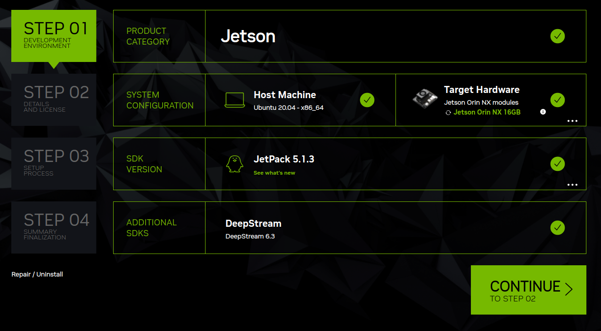
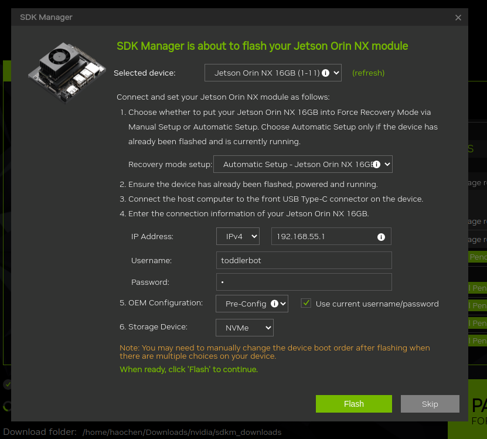

Nvidia Jetson Orin NX Linux Real-Time Kernel Build
==================================================

We use ``Jetson Linux 35.5.0`` for our system, and there are no
guarantees the following steps work for other versions.

TODO: We updated to JetPack 6.0 and Jetson Linux 36.3
=====================================================

Flashing Jetson Linux
---------------------

Important: Make sure your system will not sleep in the process below, or
the steps might fail due to disconnection.

1.  Boot your jetson, go through the basic setup process and proceed to
    desktop. Then power off
2.  Download and install SDK manager from `Nvidia
    website <https://developer.nvidia.com/sdk-manager>`__
3.  Open SDK Manager, log in, and connect the Jetson Orin through the
    USB-C jack. Power it on.
4.  You will see this page, set the preferences as in the picture,
    please select JetPack5.1.3 since we want the Ubuntu 20.04 base OS:
    |JetPack5.1.3|
5.  Next step, select all components, and continue
6.  Wait for it to download and build…
7.  When prompted to flash, since the jetson comes with system preloaded
    on SSD, we can select automatic setup (For manual setup, check later
    section of this tutorial).
8.  Set the flash as shown in the screenshot, notice the destination is
    NVME, not SD Card. |NVME|
9.  Wait for it to flash, the process could take about 15 min…
10. When prompted to install the components, set up as needed, make sure
    the jetson is at the desktop. (Tips, if unable to install through
    USB, try network, just find out the ip of jetson and type it in.)
11. Wait for it to install the components to jetson… This is another 45
    min. You might need several round of retry to install everything. No
    need to flash again when retrying, only need to install the
    components agan.

Flash (if you have non nvidia Jetson[or any carrier that has HDMI output])
--------------------------------------------------------------------------

1. We will be following this
   `guide <https://wiki.seeedstudio.com/reComputer_J4012_Flash_Jetpack/>`__,
   It’s pretty straight forward.

2. And then install the components same way as above in SDK manager,
   make sure to uncheck the flash option. (Since we alreadey flashed)
   and then we will apply the RT kernel.

Steps to Build and Install the RT Kernel
----------------------------------------

In our case, applying the RT kernel boosts the interupt frequency from
**3.5kHz** to **14kHz**.

The following are the steps one can follow to build Jetson Linux Kernel
with RT Patch on a computer and flash the Linux image to a Jetson Orin
Target host system. It is assumed ``sdkmanager`` has been run on the
host computer to flash the target system, and a directory,
``Linux_for_Tegra``, should exist somewhere in the host computer file
system. The path to ``Linux_for_Tegra`` is exported as an environment
variable ``$LINUX_FOR_TEGRA`` in the following steps.

1.  Make sure you have a host system that has Ubuntu 18.04/20.04/22.04
    installed. All the following operations are on the host system
    unless specified otherwise.

2.  Install the Jetson Linux build utilities if not already done:

    ::

        sudo apt install build-essential bc flex bison libssl-dev

3.  Download and Extract Jetson Linux Toolchain “Bootlin Toolchain gcc
    9.3” from the `download
    website <https://developer.nvidia.com/embedded/jetson-linux-r3550>`__
    to your downloads folder. Export these environment variables:

    ::

        export CROSS_COMPILE_AARCH64_PATH=<toolchain-path>
        export CROSS_COMPILE_AARCH64=<toolchain-path>/bin/aarch64-buildroot-linux-gnu-

4.  Download “Driver Package (BSP) Sources” from the `download
    website <https://developer.nvidia.com/embedded/jetson-linux-r3550>`__.

5.  Extract the .tbz2 file:

    ::

        tar -xjf public_sources.tbz2

6.  Move the extracted source directory to ``$LINUX_FOR_TEGRA/source``.

    ::

        mv Linux_for_Tegra/source/* $LINUX_FOR_TEGRA/source

7.  Extract the kernel source file:

    ::

        cd $LINUX_FOR_TEGRA/source/public
        tar –xjf kernel_src.tbz2

8.  Apply RT patches to the kernel:

    ::

        cd $LINUX_FOR_TEGRA/source/public/kernel
        ./kernel-5.10/scripts/rt-patch.sh apply-patches

9.  Build the kernel. ``kernel_out`` is the directory where the compiled
    kernel is to be written.:

    ::

        cd $LINUX_FOR_TEGRA/source/public
        mkdir kernel_out
        ./nvbuild.sh -o $PWD/kernel_out

10. Replace some files:

    ::

        sudo cp -r $LINUX_FOR_TEGRA/source/public/kernel_out/arch/arm64/boot/dts/nvidia/* $LINUX_FOR_TEGRA/source/public/kernel/dtb/
        sudo cp $LINUX_FOR_TEGRA/source/public/kernel_out/arch/arm64/boot/Image $LINUX_FOR_TEGRA/source/public/kernel/Image

11. Install kernel modules. After successful installation, the directory
    ``x.xx.xxx-rtyy-tegra`` should be found at
    ``$LINUX_FOR_TEGRA/rootfs/usr/lib/modules``, where ``x.xx.xxx`` is
    the Linux version and ``yy`` is the RT Patch version.

    ::

        cd $LINUX_FOR_TEGRA/source/public/kernel_out
        sudo make ARCH=arm64 O=$TEGRA_KERNEL_OUT modules_install INSTALL_MOD_PATH=$LINUX_FOR_TEGRA/rootfs/

12. Create a directory, extra/opensrc-dsp under the root file system
    directory,
    ``$LINUX_FOR_TEGRA/rootfs/usr/lib/modules/x.xx.xxx-rtyy-tegra`` if
    ``extra/opensrc-dsp`` doesn’t exist yet.

    ::

        cd $LINUX_FOR_TEGRA//rootfs/usr/lib/modules/x.xx.xxx-rtyy-tegra
        mkdir extra
        cd extra
        mkdir opensrc-disp

13. Build Display Driver:

    ::

        cd $LINUX_FOR_TEGRA/source/public
        tar -xjf nvidia_kernel_display_driver_source.tbz2
        cd nvdisplay
        make \
            modules \
            SYSSRC=$LINUX_FOR_TEGRA/source/public/kernel/kernel-5.10 \
            SYSOUT=$LINUX_FOR_TEGRA/source/public/kernel_out \
            CC=${CROSS_COMPILE_AARCH64}gcc \
            LD=${CROSS_COMPILE_AARCH64}ld.bfd \
            AR=${CROSS_COMPILE_AARCH64}ar \
            CXX=${CROSS_COMPILE_AARCH64}g++ \
            OBJCOPY=${CROSS_COMPILE_AARCH64}objcopy \
            TARGET_ARCH=aarch64 \
            ARCH=arm64

14. Copy display driver kernel modules to the root file system
    directory.

    ::

        cd $LINUX_FOR_TEGRA/source/public/nvdisplay
        cp kernel-open/*.ko $LINUX_FOR_TEGRA/rootfs/usr/lib/modules/x.xx.xxx-rtyy-tegra/extra/opensrc-
        disp

15. Create default username and password to skip the first time boot
    process:

    ::

        cd $LINUX_FOR_TEGRA/tools
        sudo ./l4t_create_default_user.sh -u <user> -p <pswd>

16. Follow this
    `guide <https://wiki.seeedstudio.com/reComputer_J4012_Flash_Jetpack/#flash-jetpack>`__
    to flash Jetson.

17. After the flash, the target system will start. If the Ubuntu desktop
    GUI is not displayed, remove the jumper wire, keep the USB Type-A to
    Type-C cable, and repower Jetson to reboot the machine. After the
    rboot, run these commands on the host system to enter the serial
    console of Jetson:

    ::

        sudo apt install screen
        screen /dev/ttyACM0 115200

        # Login with the username and password you just created.

        sudo depmod -a
        sudo reboot

18. Remove the USB Type-A to Type-C cable, plug in the keyboard, mouse,
    and monitor and reboot Jetson. After the reboot, run the following
    command. If “RT” is displayed in the message, we have successfully
    installed the RT kernel!

    ::

        uname -a

