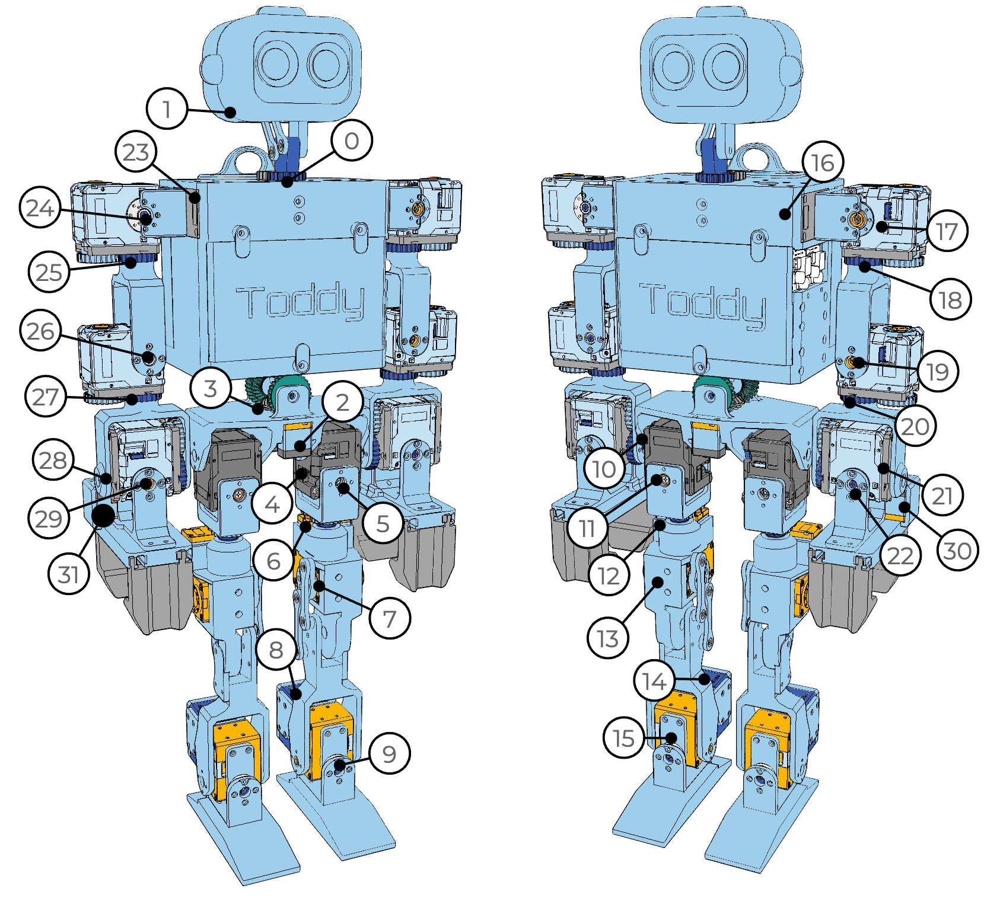

Dynamixel
=========

This tutorial will give you a basic understanding of how to use Dynamixel motors.

The actuation side vs. The idler side

Actuaion side A vs. Actuation side B

Need to ID the dynamixel motors one by one. Plugging in more than one motor at a time may lead to ID conflicts.

Set the baudrate to 2Mbps, and the ID corresponding to this map.

