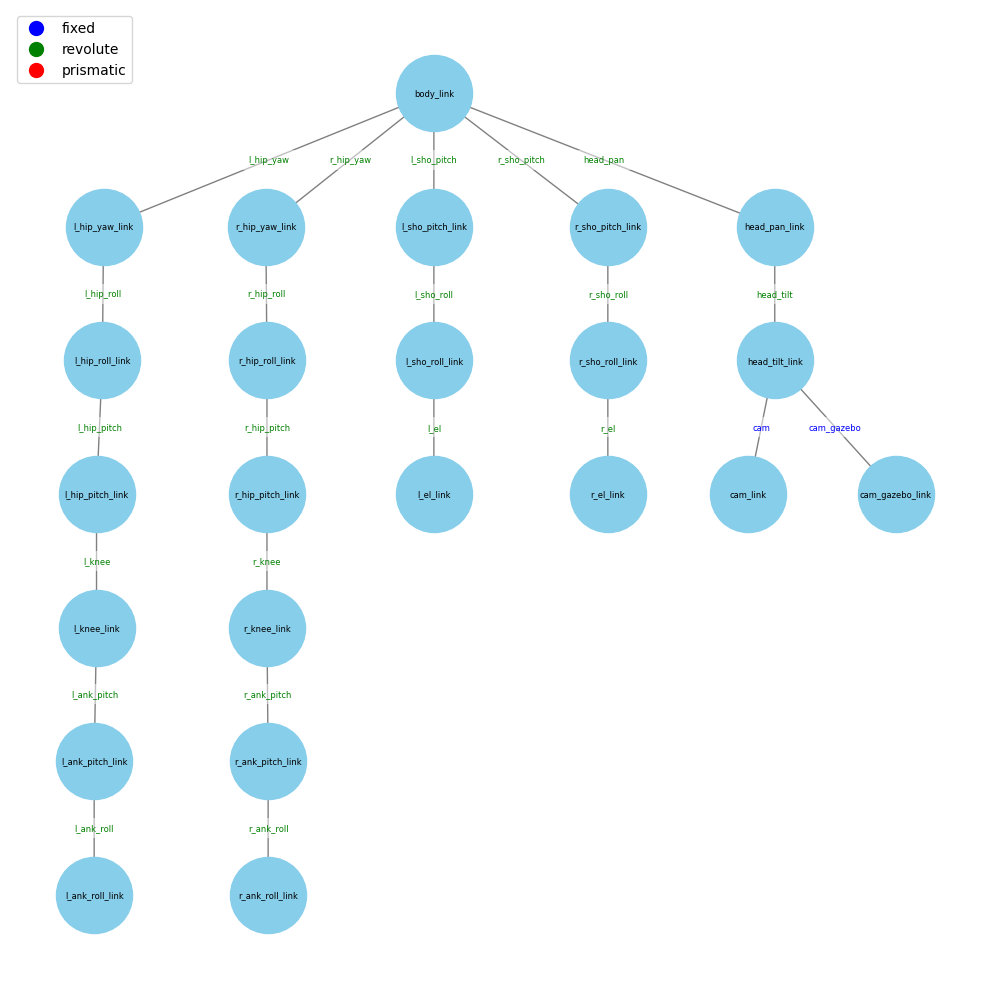

# Robot Description

## Naming Convention
1. Use snake_case for naming in URDF or MJCF files.
1. Prefix with "l_" for left-sided components and "r_" for right-sided ones.

## Kinematics Tree Template

